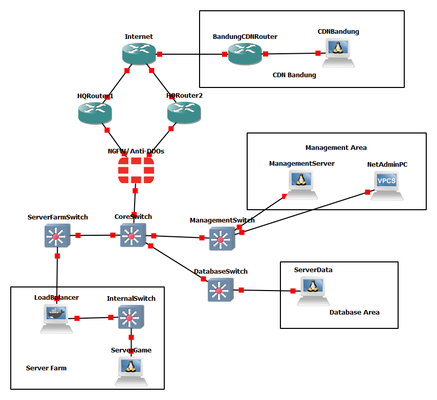
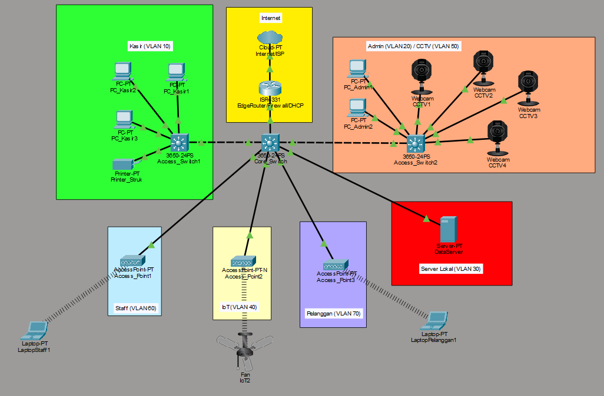

# tugas-jaringan-komputer

Repositori ini berisi kumpulan proyek simulasi arsitektur jaringan yang saya dan kelompok saya kembangkan untuk mendemonstrasikan implementasi infrastruktur IT pada skala *enterprise* dan *smart retail*. 

Semua proyek di bawah ini dibangun sebagai **Proof of Concept (PoC)** dengan fokus pada desain topologi logis, segmentasi jaringan, dan integrasi keamanan.

---

## 📌 Daftar Proyek
1. [Enterprise Game Server Architecture (GNS3)](#1-enterprise-game-server-architecture)
2. [Smart Retail Network & IoT Integration (Packet Tracer)](#2-smart-retail-network--iot-integration)

---

## 1. Enterprise Game Server Architecture
[](https://www.gns3.com/)
[]()

Proyek ini merupakan **Proof of Concept (PoC)** rancangan infrastruktur jaringan untuk perusahaan game online berskala internasional. Dirancang sebagai tugas mata kuliah Jaringan Komputer, proyek ini berfokus pada optimalisasi pengiriman konten game global serta penguatan keamanan siber terhadap ancaman digital.

**Folder:** `/perusahaan-game-gns3`

---

## 🎯 Fokus Utama
1. **Content Delivery Network (CDN):** Mempersingkat waktu pengiriman konten (*low latency*) kepada pemain di berbagai belahan dunia.
2. **Keamanan Siber:** Penerapan mitigasi serangan siber (seperti DDoS) yang sering menyasar industri *gaming*.

---

## 🏗️ Arsitektur Jaringan
Infrastruktur ini mengadopsi arsitektur jaringan hierarkis dan redundan untuk memastikan performa tinggi dan *high availability*:
* **Penerapan VLAN:** Memisahkan trafik data secara logis berdasarkan fungsi dan departemen demi efisiensi dan keamanan.
* **Redundant Router:** Implementasi rute utama ganda (*dual router*) untuk menciptakan redundansi pada jalur routing utama, meminimalisir *single point of failure*, dan mengurangi *downtime*.
* **Core Switch & Access Switch:** Menghubungkan dan mendistribusikan lalu lintas data dari jaringan inti ke perangkat akhir.

---

## 🛠️ Tools & Perangkat Perangkat (Appliances)
Simulasi jaringan ini dibangun sepenuhnya menggunakan **GNS3** dengan detail perangkat sebagai berikut:
| Kategori | Perangkat / Appliances |
| :--- | :--- |
| **Security** | Firewall (Fortigate Next-Generation Firewall) |
| **Traffic Control** | Load Balancer (HAProxy) |
| **Routing & Switching** | Cisco Routers & Cisco Layer 3 Switches |
| **Compute & Storage** | Servers (CDN, Game, & Data Servers via Net Toolbox) |
| **End Devices** | Virtual PCs (VPCs) |
| **DDoS Tester** | Kali Linux inside Net Toolbox (Docker-based) |

---

## 🌟 Sorotan Fitur & Implementasi
* **Next-Generation Firewall (NGFW):** Implementasi Fortigate Firewall di garda depan untuk menyaring trafik masuk, mendeteksi ancaman, dan melindungi infrastruktur internal.
* **Segregasi Server:** Memisahkan *Game Server* (menangani logika *in-game* seperti perhitungan *damage*) dari *Data Server* (penyimpan data sensitif pemain) untuk meminimalisir risiko kebocoran data.
* **Akselerasi Konten (CDN):** Integrasi CDN untuk *caching* aset game terdekat dari sisi pemain guna memangkas *ping* dan *latency*.
* **Beban Seimbang (Load Balancing):** Distribusi trafik secara merata ke klaster server menggunakan HAProxy untuk menjaga stabilitas layanan saat beban tinggi.

---

## ⚠️ Tantangan & Keterbatasan (Known Issues)
Karena keterbatasan spesifikasi perangkat keras (*hardware*) pada *host* lokal yang menjalankan simulator GNS3, terdapat beberapa penyesuaian pada model PoC ini:
1. **Pengujian Load Balancer:** Fitur HAProxy belum dapat diuji secara maksimal karena keterbatasan sumber daya komputasi laptop.
2. **Skalabilitas & Pengujian CDN:** Topologi saat ini baru mengimplementasikan satu buah *node* CDN. Selain itu, **tidak ada node pemain (PC/VPC) yang digunakan untuk menguji CDN**. Pengujian CDN dilakukan secara terbatas melalui pengiriman data internal antara *Game Server* dan *CDN Server* untuk memastikan data dari infrastruktur perusahaan berhasil diteruskan ke CDN.

---

## 👥 Anggota Tim
Proyek ini dikerjakan secara kolaboratif oleh:
* [Fawwaz Yaqzhan](https://github.com/230055Fawwaz)
* [Stan Fredheric](https://github.com/craten54)

---

## 🛡️ Proof of Concept: DDoS Attack Simulation

Pengujian dilakukan menggunakan **Kali Linux (Net-Toolbox Docker Container)** sebagai aktor penyerang, dan **FortiGate-VM64-KVM** sebagai target sekaligus perangkat keamanan jaringan yang memitigasi serangan.

---

### 1. UDP Flood Attack
Serangan ini bertujuan untuk membanjiri port target dengan paket UDP dalam volume besar tanpa memeriksa status koneksi, memaksa perangkat target menghabiskan sumber daya untuk memproses paket sampah.

#### 💻 Kali Linux Command & Output
```bash
┌──(root㉿Kali-1)-[/]
└─# hping3 --udp -p 80 --flood --rand-source 10.0.0.2
HPING 10.0.0.2 (eth0 10.0.0.2): udp mode set, 28 headers + 0 data bytes
hping in flood mode, no replies will be shown
^C
--- 10.0.0.2 hping statistic ---
6,863,095 packets transmitted, 0 packets received, 100% packet loss
round-trip min/avg/max = 0.0/0.0/0.0 ms
```

#### 🛡️ FortiGate Detection Log
```text
FortiGate-VM64-KVM # diagnose ips anomaly list
list nids meter:
id=udp_flood          ip=10.0.0.2 dos_id=1 exp=1000 pps=35484 freq=94886

total # of nids meters: 1.
```

* **Analisis Ringkas:** Sistem pertahanan FortiGate mendeteksi anomali dengan ID `udp_flood` pada IP tujuan `10.0.0.2` dengan kecepatan trafik serangan mencapai **35.484 packets per second (pps)**.

---

### 2. TCP SYN Flood Attack
Serangan ini menyalahgunakan proses jabat tangan (*three-way handshake*) TCP dengan mengirimkan paket SYN secara terus-menerus menggunakan IP palsu (`--rand-source`), sehingga target kehabisan kapasitas antrean koneksi (*backlog queue*).

#### 💻 Kali Linux Command & Output
```bash
┌──(root㉿Kali-1)-[/]
└─# hping3 -S -p 80 --flood --rand-source 10.0.0.2
HPING 10.0.0.2 (eth1 10.0.0.2): S set, 40 headers + 0 data bytes
hping in flood mode, no replies will be shown
^C
--- 10.0.0.2 hping statistic ---
3,832,424 packets transmitted, 0 packets received, 100% packet loss
round-trip min/avg/max = 0.0/0.0/0.0 ms
```

#### 🛡️ FortiGate Detection Log
```text
FortiGate-VM64-KVM # diagnose ips anomaly list
list nids meter:
id=tcp_syn_flood      ip=10.0.0.2 dos_id=1 exp=1000 pps=16385 freq=99639

total # of nids meters: 1.
```

* **Analisis Ringkas:** FortiGate berhasil mengidentifikasi serangan spesifik `tcp_syn_flood` yang mengarah ke IP `10.0.0.2` dengan intensitas serangan sebesar **16.385 packets per second (pps)**.

---

### Topologi Jaringan


---

## 2. Smart Retail Network & IoT Integration
[](https://www.netacad.com/)
[]()

Proyek ini merupakan simulasi infrastruktur jaringan pada lingkungan **Ritel Cerdas (Smart Retail)**. Dirancang sebagai tugas mata kuliah Jaringan Komputer, proyek ini mendemonstrasikan bagaimana perangkat *Internet of Things* (IoT) dapat diintegrasikan secara aman ke dalam jaringan korporat ritel tanpa mengorbankan privasi data internal perusahaan.

**Folder:** `/ritel-pintar--packet-tracer`

---

## 🎯 Fokus Utama
1. **Integrasi IoT:** Membangun ekosistem ritel pintar dengan memanfaatkan otomatisasi perangkat.
2. **Keamanan Trafik Jaringan:** Memisahkan akses jaringan antara pelanggan umum (publik) dengan operasional internal ritel untuk mencegah akses ilegal.

---

## 🏗️ Arsitektur Jaringan
Infrastruktur ini mengadopsi metode segmentasi jaringan modern untuk efisiensi pengalamatan dan keamanan kontrol akses:
* **Penerapan VLAN:** Memisahkan trafik data secara logis berdasarkan zona fungsi (misalnya: Jaringan Internal, Jaringan IoT, dan Jaringan Wi-Fi Pelanggan).
* **Router-on-a-Stick (Inter-VLAN Routing):** Memanfaatkan satu jalur fisik router untuk mengarahkan lalu lintas data antar segmen VLAN yang berbeda secara efisien.
* **Core Switch & Access Switch:** Hierarki switching menggunakan Cisco Layer 3 Switch sebagai pusat distribusi data ke switch akses.

---

## 🛠️ Tools & Perangkat (Appliances)
Simulasi jaringan ini dibangun sepenuhnya menggunakan **Cisco Packet Tracer** dengan detail perangkat sebagai berikut:
| Kategori | Perangkat / Appliances | Keterangan |
| :--- | :--- | :--- |
| **Security, Routing, & DHCP** | Cisco ISR 1331 | Berfungsi sebagai Firewall, Router, dan DHCP Server |
| **Switching** | Cisco 3650 (Layer 3) | Sebagai Core Switch, Access Switch, dan pembagi segmen jaringan |
| **Wireless Access** | Access Point-PT | Menyediakan konektivitas nirkabel (Wi-Fi) |
| **End Devices** | Server-PT, PC, Printer-PT, Laptop-PT | Perangkat operasional toko dan server lokal |
| **Surveillance** | WebCam (Cisco PT Node) | Digunakan sebagai representasi kamera CCTV |
| **IoT Peripherals** | Ceiling Fan | Representasi perangkat pintar ritel |

---

## 🌟 Sorotan Fitur & Implementasi
* **Segmentasi Keamanan VLAN:** Isolasi total lalu lintas data agar setiap divisi atau zona memiliki jalur komunikasinya sendiri.
* **Inter-VLAN Routing:** Implementasi metode *Router-on-a-Stick* untuk menjembatani komunikasi antar segmen yang diizinkan.
* **Proteksi Wi-Fi Publik:** Mengamankan *Wireless Access Point* menggunakan enkripsi **WPA2-PSK** untuk membatasi akses pengguna.
* **Kebijakan Firewall Ketat:** Implementasi *rules* pada Cisco ISR Firewall untuk memastikan pelanggan/pengunjung umum hanya mendapatkan akses internet dan **diblokir total** dari jaringan internal korporat ritel.

---

## ⚠️ Tantangan & Keterbatasan (Known Issues)
Dalam proses pengembangan simulasi pada lingkungan Cisco Packet Tracer, terdapat kendala teknis yang ditemukan:
* **Masalah Alokasi DHCP pada Perangkat IoT:** Perangkat IoT (*Ceiling Fan*) tidak dapat menerima penyewaan alamat IP (*IP Lease*) secara otomatis dari DHCP Server yang dikonfigurasi melalui skema *Router-on-a-Stick*. 
* **Langkah Mitigasi yang Telah Dilakukan:** Tim telah melakukan upaya pemecahan masalah (*troubleshooting*) mulai dari mengganti jenis perangkat IoT, konfigurasi ulang *Access Point*, hingga membangun kembali *DHCP pool* pada router, namun kendala atribusi IP otomatis dari *software* simulasi ini masih bertahan.

---

## 👥 Anggota Tim
Proyek ini dikerjakan secara kolaboratif oleh:
* [Fawwaz Yaqzhan](https://github.com/230055Fawwaz)
* [Daniel Bintang](https://github.com/username_daniel)
* [Jeremi Nicolas](https://github.com/username_jeremi)

---

### Topologi Jaringan


---

## 🚀 Cara Menggunakan Repositori Ini
Setiap proyek memiliki foldernya masing-masing. Di dalam folder tersebut, Anda dapat menemukan:
*   File simulasi (`.gns3` atau `.pkt`)
*   Dokumentasi pendukung dan laporan analisis
*   Folder `konfigurasi-appliances/` dan folder `konfigurasi/` yang berisi teks konfigurasi mentah (*raw config*) dari perangkat jaringan yang digunakan.

## 📬 Kontak
Mari terhubung di [LinkedIn](https://www.linkedin.com/in/fawwaz-yaqzhan-820aa3299/) untuk berdiskusi lebih lanjut mengenai jaringan dan keamanan siber!
